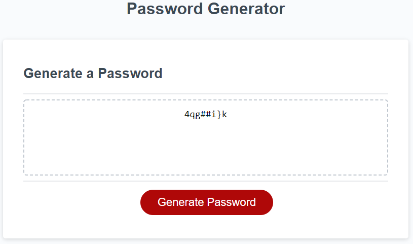

# Homework Unit Three:
# JavaScript: Password Generator

## Description of the homework:

In this homework, I created a password generator using javascript that takes input from the user to create a pasword . 

The page displays a create password button to begin password generator. 
Once the program starts, a prompt displays a question for the user to pick a number. After that, other prompts will be displayed one at a time, asking the user to choose if they want special characters, number characters, uppercase and lowercase letters to be added to the password. 

If the number chosen is smaller than 8 or bigger than 128 letters long, an alert prompt will display letting the user know there is an error. If the user does not write any number, an error message will prompt to let the user know there was no number chosen. If the user does not choses any of the options, then an error message will be prompt letting the user know there is an error.  

If everything is correct, then the password generator creates the password and displays it on the box label YOUR SECURE PASSWORD.

### Link to application [HERE](https://marymd98.github.io/Unit3-Homework/)

## Screenshot of the pasword generator:
Below are screenshots of the Pasword Generator 

